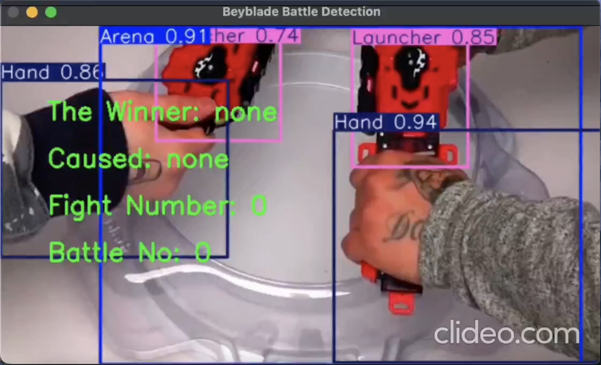
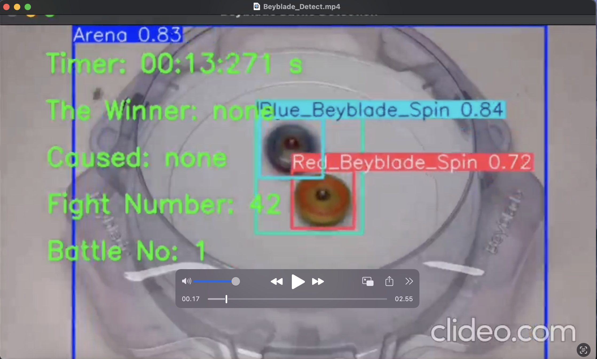

# Beyblade Detection and Battle Data Logging

This project uses a pre-trained YOLO model to detect and analyze Beyblade fights in a video. It processes the video frames, detects the spinning Beyblades, tracks their movements, and logs the battle outcomes into a CSV file.

## Project Structure
1. **YOLO Model**: The project uses the YOLO model for object detection, which has been pre-trained on a Beyblade dataset.
2. **Video Processing**: The project processes a video file frame by frame to detect objects in real time.
3. **Battle Logging**: The results of each battle (e.g., duration, winner, and cause) are saved in a CSV file.

## Files
- **run.ipynb**: Jupyter notebook that contains the code for detecting Beyblade activities in the video and logging the battle data.
- **beyblade_battle_data_pandas.csv**: CSV file generated by the notebook that contains details about each battle.

## Code Breakdown

### 1. Import Libraries
The project imports the following essential libraries:
- `YOLO`: For loading the pre-trained YOLO model and performing object detection.
- `cv2`: For video processing and frame capturing.
- `csv`: For saving battle data in CSV format.
- `time`: For managing time data such as battle duration.
- `pandas`: For handling and saving data in a DataFrame.

### 2. Load YOLO Model and Video
The YOLO model is loaded from a specified file path, and the video is loaded using OpenCV:
```python
model = YOLO('/path/to/best.pt')
video = '/path/to/video.mp4'
cap = cv2.VideoCapture(video)
```

### 3. Prepare CSV File for Battle Data
A CSV file is initialized with the following columns:
- `Battle Number`: Tracks the battle number.
- `Duration (s)`: Duration of the battle in seconds.
- `Winner`: Identifies the winner (either Red or Blue Beyblade).
- `Cause`: The reason for winning (e.g., spinning outside the arena).
- `Fight Count`: The number of "fights" detected in the battle.

### 4. Detect Beyblade Moving Outside the Arena
The function `is_out_of_arena` determines whether a Beyblade has moved outside the predefined arena boundaries. It checks the bounding box coordinates of the detected object and returns `True` if the Beyblade is out of bounds:
```python
def is_out_of_arena(bbox):
    x_min, y_min, x_max, y_max = bbox
    if x_min < arena_top_left[0] or y_min < arena_top_left[1] or x_max > arena_bottom_right[0] or y_max > arena_bottom_right[1]:
        return True
    return False
```

### 5. Save Data to CSV
The function `save_to_dataframe_csv` saves the battle data (e.g., battle number, duration, winner, cause, and fight count) to a Pandas DataFrame, which is then exported to a CSV file:
```python
def save_to_dataframe_csv(battle_data):
    global battle_df
    new_row = pd.DataFrame([battle_data], columns=columns)
    battle_df = pd.concat([battle_df, new_row], ignore_index=True)
    battle_df.to_csv('beyblade_battle_data_pandas.csv', index=False)
```

### 6. Frame-by-Frame Video Processing
The project processes each frame of the video using YOLO detection to identify Beyblades, track their positions, and determine if they spin outside the arena. Battle outcomes are recorded based on the object movements detected in the frames.

## How to Run
1. Load the Jupyter Notebook (`run.ipynb`).
2. Ensure the YOLO model (`best.pt`) is in the correct path.
3. Update the video path to the location of your Beyblade video.
4. Run the notebook. The results will be saved in a CSV file (`beyblade_battle_data_pandas.csv`).

## Future Improvements
- Enhance the detection accuracy by fine-tuning the YOLO model on a larger dataset.
- Implement additional logic for more complex battle outcome detection.
- Visualize the detection and battle results in real-time.


## Example Screenshots

Below are two screenshots from the Beyblade detection system in action:

1. **Initial Setup (Battle 0)**: 
   - Both Red and Blue Beyblades are in the initial stage before the fight begins.
   - The system has detected hands, launchers, and the arena.
   - No winner has been declared yet as the fight has not started.

   

2. **Mid-Battle (Battle 1)**:
   - The system is actively detecting the Beyblades during the fight. 
   - The spinning Blue and Red Beyblades are being tracked.
   - The timer indicates that the battle is ongoing, but no winner has been declared as the Beyblades are still within the arena.
   
   


## Model and Dataset Information

The model used in this project is based on **YOLO v11** for object detection. The dataset was annotated using the **Roboflow Anotator** tool. 
The dataset was sourced from a Beyblade video on YouTube, which can be accessed at the following link:
[YouTube Beyblade Video](https://www.youtube.com/watch?v=CIfr5618vy4).

The annotated dataset includes several key objects such as:
- Red Beyblade (spinning and stopped)
- Blue Beyblade (spinning and stopped)
- Arena
- Hands
- Launchers

This dataset was used to train the YOLO v11 model, which is then used to detect these objects in real-time video feeds.

## Model Performance Analysis

The model performance can be visualized through several key metrics as shown below:

### 1. Confusion Matrix
The confusion matrix shows how well the model is classifying each of the Beyblade classes. The diagonal cells represent correct predictions, while off-diagonal cells indicate misclassifications.

- The model is most accurate in detecting the `Arena` and `Red_Beyblade_Spin`, with 18 and 16 correct predictions, respectively.
- There are some minor misclassifications between `Blue_Beyblade_Spin` and `Blue_Beyblade_Stop`, indicating that the model sometimes confuses these states.


### 2. F1-Confidence Curve
The F1-Confidence curve provides insights into the precision and recall of the model across different confidence thresholds. A higher F1 score indicates better balance between precision and recall.

- The model achieves an F1 score of 0.93 across all classes, at a confidence threshold of 0.504.
- The performance is consistent across most of the classes, as indicated by the tight clustering of the curves at high confidence levels.


### 3. Labels Correlogram
The labels correlogram provides an overview of the distribution of bounding box coordinates (x, y, width, height) for the detected objects. This helps in understanding how the objects are distributed across the video frame.

- The distribution indicates that the Beyblades tend to stay close to the center of the frame (as shown by the concentration of values around the middle).
- The width and height distributions suggest that most objects are of consistent size, likely corresponding to the arena or Beyblade.


### 4. Results Overview
The model's performance in terms of precision, recall, and F1 score can be further explored using the CSV file which logs the metrics for each class. You can download it for more detailed analysis:
[Download Results CSV](sandbox:/mnt/data/results.csv)

## Conclusion

Based on the confusion matrix and F1-confidence curve, the model trained on the YOLO v11 architecture demonstrates strong performance, with an overall F1 score of 0.93. 

While the model is highly accurate in detecting key objects such as the `Arena` and `Red_Beyblade_Spin`, there are some misclassifications between `Blue_Beyblade_Spin` and `Blue_Beyblade_Stop`. These could be improved by refining the dataset or tuning the model further.

Overall, the model performs well for real-time Beyblade detection and tracking, making it a valuable tool for analyzing battles in real-time.

### 5. Beyblade Battle Data

The battle data extracted from the video, including key metrics such as battle number, duration, winner, and cause of the win, is stored in the following CSV file:
[Download Beyblade Battle Data CSV](sandbox:/mnt/data/beyblade_battle_data_pandas.csv)

This data was captured during the real-time detection and includes details like:
- Battle Number
- Fight Duration
- The Winner (Blue or Red Beyblade)
- The Cause of Winning (e.g., spinning outside the arena)
